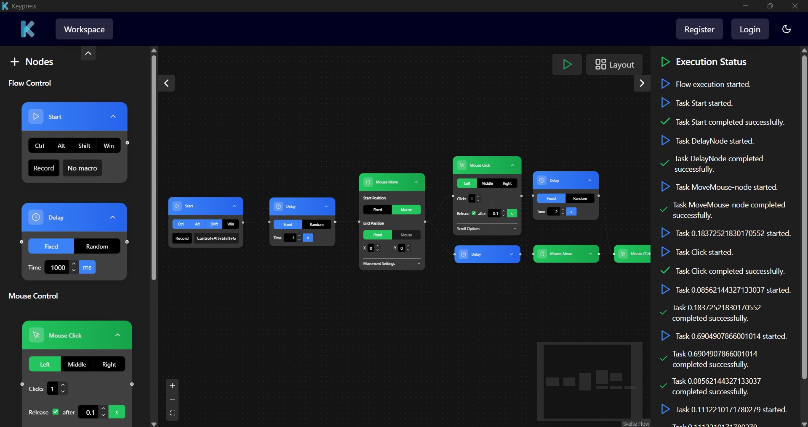

# Keypress

An auto clicker with a visual flowchart interface for creating and executing complex mouse and keyboard automation sequences.



## Overview

Keypress combines a Go backend for system-level automation with a modern SvelteKit frontend, providing an intuitive drag-and-drop interface for building automation workflows. The application uses Wails v2 to bridge native desktop capabilities with web technologies.

## Technical Stack

**Backend**
- Go 1.22+ with concurrent task execution
- [Wails v2](https://wails.io/) for desktop application framework
- [robotgo](https://github.com/go-vgo/robotgo) for cross-platform mouse/keyboard control
- XDG Base Directory specification for file management

**Frontend**
- SvelteKit with TypeScript
- Vite for build tooling and hot reload
- [@xyflow/svelte](https://github.com/xyflow/xyflow) for node-based flow editor
- Tailwind CSS for styling

## Architecture

The application implements a hybrid architecture with clear separation of concerns:

```
┌─────────────────────────────────────────┐
│         Frontend (SvelteKit)            │
│  - Visual Flow Editor                   │
│  - Node-based UI Components             │
│  - Real-time Event Listeners            │
└──────────────┬──────────────────────────┘
               │ Wails Bridge
               │ (Bindings + Events)
┌──────────────┴──────────────────────────┐
│         Backend (Go)                    │
│  - Task Queue System                    │
│  - Automation Execution Engine          │
│  - File Persistence (XDG)               │
│  - System Integration (robotgo)         │
└─────────────────────────────────────────┘
```

### Key Design Patterns

**Backend**
- Worker pool pattern with goroutines for concurrent task execution
- Dependency graph resolution for task ordering
- Event-driven architecture for real-time frontend updates
- Context-based cancellation for graceful shutdown

**Frontend**
- Component-based architecture with Svelte
- Reactive state management with Svelte stores
- Node-based visual programming interface
- Type-safe Wails bindings

## Features

### Visual Flow Editor
- Drag-and-drop node creation and connection
- Real-time flow visualization
- Node types: Start, Mouse Move, Mouse Click, Keyboard Input, Delay
- Visual feedback during execution

### Mouse Automation
- Coordinate-based or relative positioning
- Movement paths: straight line or human-like curves
- Configurable speed with optional randomization
- Click actions (left, right, middle button)
- Multi-click support with configurable delays
- Click-and-drag operations
- Scroll support (vertical and horizontal)

### Keyboard Automation
- Text typing with natural simulation
- Key combinations and shortcuts
- Individual key press actions

### Timing Control
- Fixed delays with millisecond precision
- Random delays within min/max range for human-like behavior

### Execution Engine
- Concurrent task execution with worker pool (3 workers default)
- Automatic dependency resolution based on flow connections
- Real-time status updates via event system
- Graceful error handling and recovery

### File Management
- Auto-save to XDG-compliant data directory
- Automatic loading of last edited flow
- JSON-based flow data format

## Project Structure

```
Keypress/
├── main.go                 # Wails application entry point
├── app.go                  # Core application logic and Wails bindings
├── utils/
│   └── fileutils.go        # File system utilities
├── frontend/
│   ├── src/
│   │   ├── routes/         # SvelteKit pages
│   │   ├── lib/
│   │   │   ├── components/ # UI components
│   │   │   ├── stores/     # State management
│   │   │   └── wailsjs/    # Generated Wails bindings
│   │   └── app.html
│   ├── static/             # Static assets
│   └── build/              # Production build output
└── build/                  # Compiled desktop application
```

## Development

### Prerequisites
- Go 1.22+
- Node.js 18+
- Wails CLI (`go install github.com/wailsapp/wails/v2/cmd/wails@latest`)

### Development Mode
```bash
wails dev
```
Runs with hot reload. Frontend available at http://localhost:34115 for browser testing.

### Production Build
```bash
wails build
```
Creates a redistributable desktop application with embedded frontend.

### Frontend Development
```bash
cd frontend
npm install
npm run dev        # Development server
npm run build      # Production build
npm run check      # Type checking
```

## Implementation Details

### Task Queue System

The execution engine uses a buffered channel-based task queue with a configurable worker pool:

```go
type TaskQueue struct {
    tasks   chan Task
    wg      sync.WaitGroup
    ctx     context.Context
    cancel  context.CancelFunc
}
```

Workers process tasks concurrently while respecting dependency constraints defined by flow connections.

### Dependency Resolution

The application builds a dependency graph from flow edges and ensures tasks execute only when all dependencies are met:

```go
dependencies map[string][]string  // source -> targets
completed    map[string]bool      // track completion
```

### Event System

Backend emits events that frontend listens to for real-time updates:
- `task-started`, `task-completed`, `task-error`
- `execution-completed`, `execution-stopped`
- `save-success`

### Data Structures

**Node**
```go
type Node struct {
    ID       string
    Type     string
    Data     map[string]interface{}
    Position map[string]float64
}
```

**Edge**
```go
type Edge struct {
    ID     string
    Source string
    Target string
}
```

## Platform Support

- **Windows**: Primary development platform
- **Linux**: Supported via robotgo and Wails
- **macOS**: Supported via robotgo and Wails (requires testing)

## Configuration

- `wails.json` - Wails project configuration
- `go.mod` - Go dependencies
- `frontend/package.json` - Node.js dependencies
- `frontend/svelte.config.js` - Svelte configuration
- `frontend/vite.config.ts` - Vite build configuration
- `frontend/tailwind.config.js` - Tailwind CSS configuration

## License

This project is available for portfolio and demonstration purposes.

## Author

Alexander Marshall
